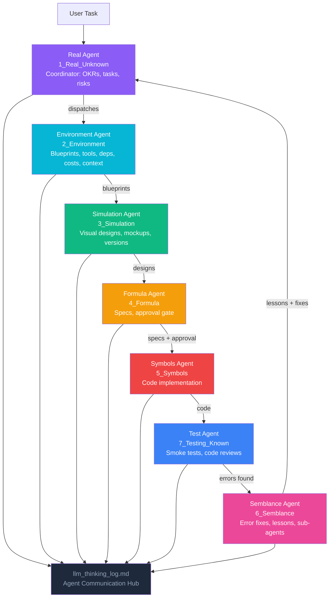

# delivery-pilot-template

A template for **self-learning projects using AI agents**. This project provides a structured 7-stage framework with 7 dedicated agents that guide the journey from problem definition to validated deployment — with each agent owning its stage and communicating through a shared thinking log.

## Agentic Workflow



**How the agents communicate**: All 7 agents write their reasoning to `4_Formula/llm_thinking_log.md`. Upstream agents log their decisions; downstream agents read those logs before acting. The Semblance Agent closes the loop by feeding resolved errors and lessons back to the Real Agent.

---

## Why Use This Template? — Self-Learning Through Agentic Feedback

This template is designed as a **self-learning platform** — every project built with it becomes smarter over time. The 7-stage structure with 7 dedicated agents creates closed-loop learning:

| Agent | Learning Mechanism |
|-------|-------------------|
| **Real Agent** | Evolves responsibility — scans the status quo, updates `risks.md` with new risks, applies mitigations |
| **Environment Agent** | Compares models/tools, tracks costs, suggests optimizations — recorded in `costs.md` |
| **Simulation Agent** | Creates versioned designs — every iteration is preserved for comparison |
| **Formula Agent** | Specs are versioned and checked against incoming tasks — warns when behavior conflicts |
| **Symbols Agent** | Coding rules in `5_Symbols/rules/` enforce consistency — lessons become standards |
| **Test Agent + Semblance Agent** | **Sub-synthesis loop**: Test finds errors → Semblance fixes + analyzes → creates sub-agents to mitigate root causes → lessons fed back to Real Agent |

**The feedback loop**: Every error found in `7_Testing_Known` flows through `6_Semblance/` (as documented fixes and lessons), then back to the Real Agent. The Real Agent uses this to update `risks.md` and adjust task priorities. Over time, the project learns from every mistake — each resolved error makes the system stronger.

---

## 🧠 Cognitive Mapping — 7 Stages to Self-Learning

The framework mimics how humans learn: recognize ignorance, build context, visualize, synthesize, execute, get feedback, and consolidate.

| Stage | Folder | Cognitive Step | Agent |
|-------|--------|---------------|-------|
| 1 | `1_Real_Unknown` | **Active Ignorance** — State what you don't know | Real Agent |
| 2 | `2_Environment` | **Mental Sandbox** — Build context and constraints | Environment Agent |
| 3 | `3_Simulation` | **Visualization** — Make the invisible visible | Simulation Agent |
| 4 | `4_Formula` | **Synthesis** — Plan, spec, and decide | Formula Agent |
| 5 | `5_Symbols` | **Execution** — Turn plans into reality | Symbols Agent |
| 7 | `7_Testing_Known` | **Validation** — Prove it works | Test Agent |
| 6 | `6_Semblance` | **Feedback Loop** — Learn from errors, improve | Semblance Agent |

---

## How to use

1. Fork or clone this repo
2. Read `agents.md` for agent coordination rules
3. Read `prompts.md` for the project management framework
4. Start with `1_Real_Unknown/` — define your problem
5. Let AI agents guide you through each stage

## Links

- **GitHub Pages:** [https://rifaterdemsahin.github.io/delivery-pilot-template/](https://rifaterdemsahin.github.io/delivery-pilot-template/)
- **GitHub:** [delivery-pilot-template](https://github.com/rifaterdemsahin/delivery-pilot-template)
- **LinkedIn:** [rifaterdemsahin](https://www.linkedin.com/in/rifaterdemsahin/)
- **YouTube:** [@RifatErdemSahin](https://www.youtube.com/@RifatErdemSahin)

> Example of a live Pages site: [https://rifaterdemsahin.github.io/proxmox/](https://rifaterdemsahin.github.io/proxmox/)

---

## Refactor 
```
Refactor the existing project . use the template from > https://github.com/rifaterdemsahin/delivery-pilot-template
Replace the codes the necessary folders and fix the broken links > commit push > use this key vault to save and get secrets /vaults/dp-kv-deliverypilot/secrets, do not create a new key vault
```

